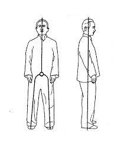
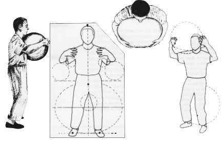

# Beginner introduction to Zhan Zhuang (Standing meditation)

Zhan Zhuang is a standing meditation with origins in China. It is also known as standing like a tree or standing like a post. My way of practicing is influenced by The Mind Illuminated (TMI) by Culadasa. I will explain the basics of Zhan Zhuang and how I practice it. This is based on my own experience and understanding, so take this with a grain of salt.

## Why Zhan Zhuang?

Standing meditation is an excellent tool to have in your toolbox. It complements your sitting practice, and works as an antidote you can apply to dullness. Being sleepy is no excuse to not meditate anymore. You can just stand up and do some Zhan Zhuang, or any other practice of choice while standing. It directly promotes physical pliancy, but it also forces you to learn how to relax your body. It is very hard to brute force your way through 45 minutes of motionless standing in one posture.

When standing still we normally engage unnecessary muscles, which is fatiguing. There are also unbalanced tensions in the body, which lead to aches and pains. In some traditions these are referred to as energy blockages. By systematically relaxing these tensions, you resolve these blockages and the aches and pains go away. This is one of the main purposes of Zhan Zhuang.

The tension within each muscle is also unbalanced when holding a position. Some muscle fibers are under more tension than others. By continuously relaxing the muscles, you will over time balance the tension within each muscle. When the tension is balanced, the muscle is less strained, more relaxed and you can hold the posture for longer.

In the beginning the practice is uncomfortable. When you get to a certain level, it becomes pleasant and relaxing. It can feel like you can hold a position indefinitely.

## Basic postures

### Wuji (Wu Chi)

- Feet hip or shoulder width apart
- Knees slightly bent
- Pelvis tilted forward
- Arms hanging down
- Head straight
- Tongue on roof of mouth
- Eyes closed
- Breathe naturally
- Relax

### Holding the balloon

- Like Wuji, but arms are out in front of you, as if holding a balloon

## Main practice loop

After getting into the posture, relax and breathe naturally. When you notice an ache or tension, relax into it. Keep attending to that area until the ache or tension goes away. Then, move on to the next area. Some aches go away quickly, others take longer. Some aches may not go away at all. That is okay. Just keep attending to them. Try to relax the areas above or under the ache, or to its sides.

If there is no ache or tension, just relax and breathe naturally. If you notice your mind wandering, just bring it back to the body. You can also do body scanning, intending to relax each part of the body as you go. Intend to notice the sensations in each part of the body with as much clarity as possible.

Subtle dullness is a common protection mechanism of the mind to blunt any discomfort caused by aches and tension. Having the intention of observing the sensations with greater clarity and detail helps counter the dullness. It is especially useful to notice the aversion to the discomfort. You need to be with the discomfort, make the mind/body find a way to handle the discomfort that isn't fleeing into dullness or distractions.

## Starting progression

The general recommendation is to do 40 minutes a day for health benefits and 60 minutes a day for martial artists.

Start with 5 minutes a day, preferably multiple sessions per day for faster progress. Wuji position only. Increase the time with one minute each day until you can do 30-45 minutes.

When you can do a full session without any stubborn aches you can start adding the holding the balloon posture. Start with 5 minutes Wuji as warmup, then 5 minutes holding the balloon, then back to wuji. Increase the duration of holding the balloon with 1 minute per day until you can do it for 30-45 minutes.

## Advanced postures

There are many advanced postures, designed to find some new kind of ache or tension. There are also other variations of the Wuji posture. I won't go into detail here, but these can be of interest when you do not have any aches to work with anymore.

## Advanced concepts

As mentioned earlier, this flavour of Zhan Zhuang is influenced by TMI. In more traditional Zhan Zhuang, there are other concepts to be aware of. I do not have a deep understanding of these concepts, as I tried to limit the scope of my practice. I will mention them here and you can find more information in books or the internet.

Alignment of ming meng (life gate) and bai hui (hundred meetings). Ming meng is located in the lower back, and bai hui is located on the top of the head. When these two points are aligned, the spine is straight.

Alignment of the three dantians. The three dantians are the lower, middle and upper dantian. The lower dantian is located in the lower abdomen, the middle dantian is located in the chest, and the upper dantian is located in the head.

Distribution of pressure on the feet. The pressure should be distributed evenly on the feet.

Aware of energy sensations. Aware of energy channels and meridians.

There are also multiple breathing techniques.

## Resources

- [The Way of Energy](https://www.amazon.com/Way-Energy-Mastering-Internal-Strength/dp/0671736450)
- [The Mind Illuminated](https://www.amazon.com/Mind-Illuminated-Meditation-Integrating-Mindfulness/dp/1501156985)
- [Inside Zhan Zhuang](https://www.amazon.com/Inside-Zhan-Zhuang-Mark-Cohen/dp/0988317885)
